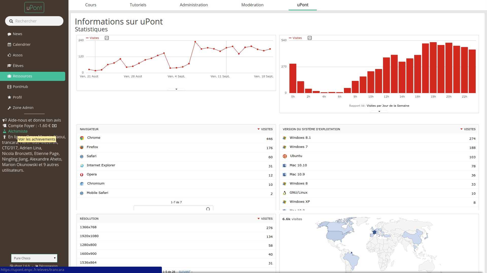

uPont 2.0
=========

uPont version 2.0, the intranet of the _École nationale des ponts et chaussées_. It features an AngularJS front-end powered by a Symfony3 REST API.

Demo Concepts
-------------

_The login page_

_The news page with a calendar of the incoming events_

_The students page with custom filters_

_The app features 12 themes_

_Yet another page_

Documentation
-------------

  * [Installation](doc/installation.md)
  * [Git Workflow](doc/git-workflow.md)
  * [Deployment](doc/deploy.md)

Team
----

See [contributors](https://github.com/KIClubinfo/upont/graphs/contributors).

Join the project
----------------
Join the [Trello board](https://trello.com/b/a7pIk6zk/upont).

Tutorials (in French):
  * Git :
    [OpenClassroom's tutorial](https://openclassrooms.com/courses/developpez-vos-applications-web-avec-angularjs)
    [Interactive tutorial](http://learngitbranching.js.org/)
  * [HTML/CSS](http://openclassrooms.com/courses/apprenez-a-creer-votre-site-web-avec-html5-et-css3)
  * [PHP](http://openclassrooms.com/courses/concevez-votre-site-web-avec-php-et-mysql)
  * [Symfony3](https://openclassrooms.com/courses/developpez-votre-site-web-avec-le-framework-symfony) (très proche de Symfony2)
  * AngularJS :
    [OpenClassroom's course](http://openclassrooms.com/courses/angular-js)
    [Grafikart's YT playlist](https://www.youtube.com/playlist?list=PLjwdMgw5TTLUDlJyx4yIPQjoI-w-7Zs1r)
  * [OnsenUI](http://onsen.io/guide/overview.html)
  * [Composer](https://www.youtube.com/watch?v=EBZ1owgiSSQ)
